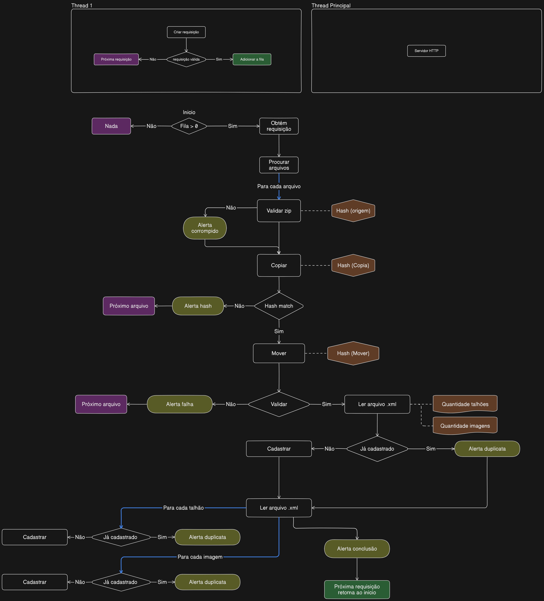

# Filemanager

## Estrutura

## Docker

## Serviço

## Objetivo

## Utilização

## Manutenção

## Health Check

Ao iniciar este programa, o mesmo irá iniciar um micro-serviço HTTP (port: 50757) com uma única rota /health. Esta rota tem como objetivo apenas retornar o status code 200, indicando que o serviço está em funcionamento. Programas externos podem enviar uma requisição para
`http://ip-machine:50757/health`
e verificar o status code recebido, se retornar 200, indica sucesso.

## Fluxograma

Fluxograma referente à lógica aplicada no processamento dos dados.

